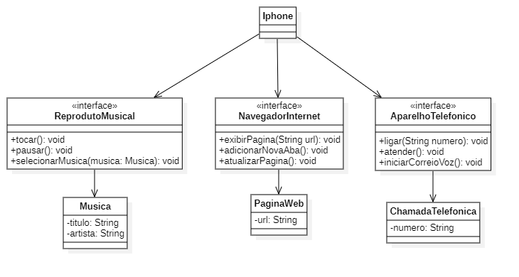

# Desafio Diagramção Classes do Iphone

Este repositório contém a solução para o desafio proposto pela Digital Innovation One.

## Desafio

O desafio consiste em criar um sistema que simule as funcionalidades de um iPhone, incluindo um reprodutor musical, um aparelho telefônico e um navegador de internet. Cada funcionalidade deve ser representada por interfaces e implementadas em uma classe `iPhone`.

### Funcionalidades

- **Reprodutor Musical:**
  - Tocar música
  - Pausar música
  - Selecionar música
- **Aparelho Telefônico:**
  - Fazer uma ligação
  - Atender uma chamada
  - Iniciar correio de voz
- **Navegador de Internet:**
  - Exibir uma página web
  - Adicionar uma nova aba
  - Atualizar a página

## Diagrama UML

<p align="center">
  
</p>

## Estrutura do Projeto

O projeto está estruturado da seguinte forma:

- `src/`
  - `com/iphone/`
    - `interfaces/`: Contém as interfaces do sistema.
    - `models/`: Contém as classes de modelo do sistema.
    - `devices/`: Contém a classe `Iphone` que implementa as funcionalidades.

## Resultado Esperado

O resultado esperado é um sistema funcional que simule as funcionalidades de um iPhone, conforme descrito nas funcionalidades acima.

```
Musica
Selecionando música: Stairway to Heaven
Tocando música...
Pausando música...

Chamada
Ligando para: 123456789
Atendendo chamada...
Iniciando correio de voz...

Pagina Web
Exibindo página: www.example.com
Adicionando nova aba: www.example.com
Atualizando página...
```

## Como Executar

Para executar o projeto, basta compilar e executar a classe `Iphone.java`.

```bash
javac src/com/iphone/devices/Iphone.java
java src/com/iphone/devices/Iphone
```
